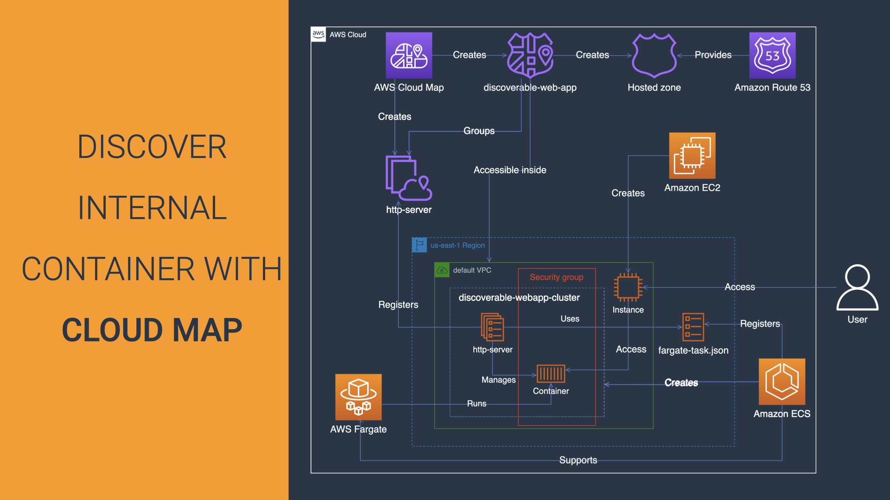

# DISCOVER INTERNAL CONTAINER WITH CLOUD MAP 

This repository groups artefacts used on the Youtube video: 

## Project Overview

In this project, you enable users in your VPC to dynamically discover and access a containerised service. You do so, by creating a set of Cloud Map resources, and linking these resources to your ECS service.
